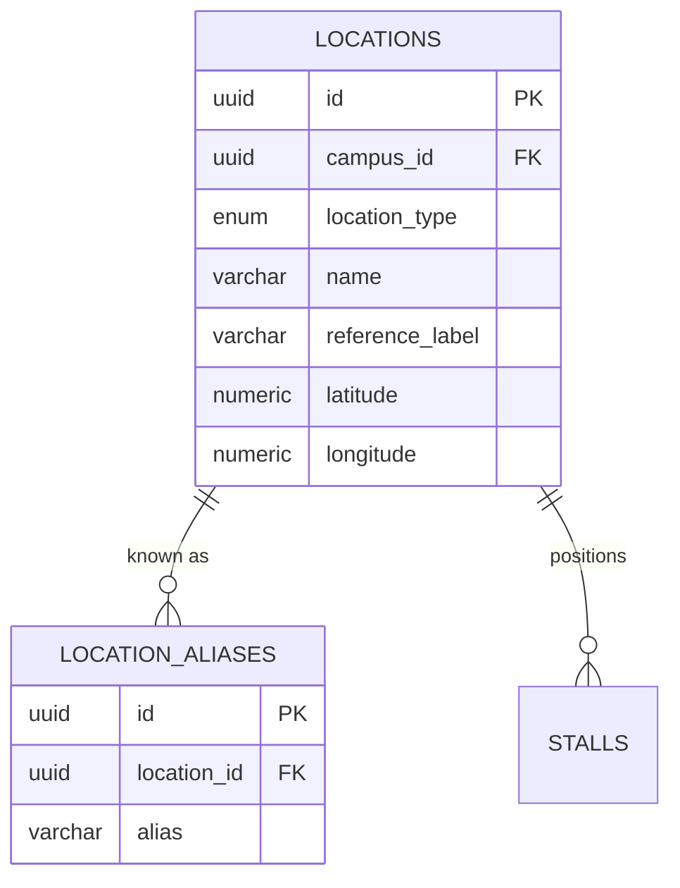
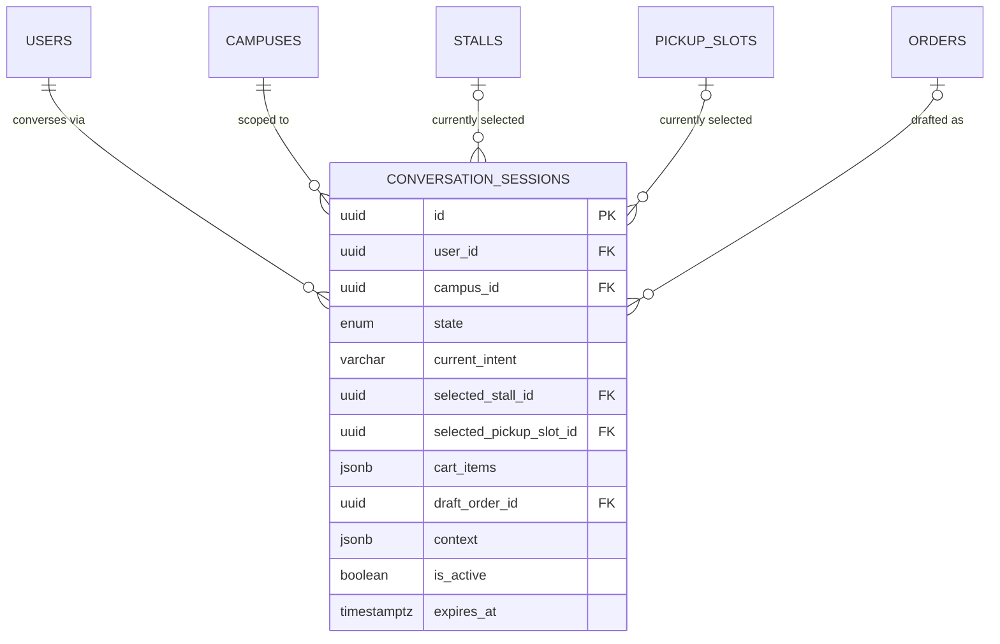

# ER Diagram — CampusBite AI

**Milestone 2 (Revised / FINAL): Database Architecture**
Diagrams are Mermaid `erDiagram` syntax, split into logical clusters —
a single 34-table diagram is not readable. See `DATABASE_DESIGN.md`
for full column-level detail and `schema.sql` for the executable DDL.

---

## 1. Identity & Campus

```mermaid
erDiagram
    CAMPUSES ||--o{ LOCATIONS : "has"
    CAMPUSES ||--o{ STUDENTS : "enrolls"
    CAMPUSES ||--o{ ADMINS : "scopes (nullable)"
    USERS ||--o| STUDENTS : "is-a"
    USERS ||--o| VENDORS : "is-a"
    USERS ||--o| ADMINS : "is-a"

    USERS {
        uuid id PK
        enum role
        varchar phone_number UK
        varchar email UK
        varchar full_name
        timestamptz deleted_at
    }
    CAMPUSES {
        uuid id PK
        varchar name
        varchar code UK
        timestamptz deleted_at
    }
    STUDENTS {
        uuid user_id PK_FK
        uuid campus_id FK
        varchar registration_number UK
        enum dietary_preference
    }
    VENDORS {
        uuid user_id PK_FK
        varchar business_name
        timestamptz verified_at
    }
    ADMINS {
        uuid user_id PK_FK
        enum admin_level
        uuid campus_id FK
    }
    LOCATIONS {
        uuid id PK
        uuid campus_id FK
        enum location_type
        varchar name
        numeric latitude
        numeric longitude
    }
```

**Notes**
- `students`, `vendors`, `admins` are 1:1 extensions of `users`.
- `students.dietary_preference` reuses `food_type_enum` (see cluster 2) rather than a second, near-identical enum.

---

## 2. Campus Locations & Aliases



**Notes**
- One `locations` row can have many `location_aliases` rows (e.g. "Library" → "Lib", "Central Library"). Aliases are normalized rows, never a JSON/array column — each is independently indexable for natural-language matching.
- `locations` has no `block_id` — `location_type` (block / nearby_block / building / landmark / outdoor_area / open_space) plus free-text `reference_label` uniformly model formal and informal positioning.

---

## 3. Stalls, Catalog & Search Aliases

```mermaid
erDiagram
    VENDORS ||--o{ STALLS : "owns"
    LOCATIONS ||--o{ STALLS : "positions"
    STALLS ||--o{ STALL_SEARCH_ALIASES : "known as"
    STALLS ||--o{ STALL_OPERATING_HOURS : "scheduled by"
    STALLS ||--o{ MENU_CATEGORIES : "organizes"
    STALLS ||--o{ MENU_ITEMS : "sells"
    MENU_CATEGORIES ||--o{ MENU_ITEMS : "groups"
    MENU_ITEMS ||--o{ MENU_ITEM_SEARCH_ALIASES : "known as"
    MENU_ITEMS ||--o| MENU_ITEM_EMBEDDINGS : "embedded as"
    MENU_ITEMS ||--o| INVENTORY : "tracked by"
    INVENTORY ||--o{ INVENTORY_LOGS : "audited by"

    STALLS {
        uuid id PK
        uuid vendor_id FK
        uuid location_id FK
        varchar name
        varchar slug UK
        enum status
    }
    STALL_SEARCH_ALIASES {
        uuid id PK
        uuid stall_id FK
        varchar alias
    }
    MENU_ITEMS {
        uuid id PK
        uuid stall_id FK
        uuid category_id FK
        varchar name
        numeric price
        enum food_type
        enum status
    }
    MENU_ITEM_SEARCH_ALIASES {
        uuid id PK
        uuid menu_item_id FK
        varchar alias
    }
    MENU_ITEM_EMBEDDINGS {
        uuid id PK
        uuid menu_item_id FK_UK
        vector embedding
    }
    INVENTORY {
        uuid id PK
        uuid menu_item_id FK_UK
        enum status
        int quantity_available
    }
    INVENTORY_LOGS {
        uuid id PK
        uuid inventory_id FK
        enum change_type
        int quantity_delta
    }
```

**Notes**
- `stall_search_aliases` ("Burger Shop" / "Burger Point" / "Burger Stall") and `menu_item_search_aliases` ("French Fries" / "Fries" / "Finger Chips") are both normalized 1:N tables — never JSON/array columns — matching the required pattern from `location_aliases`.
- `menu_items.food_type` (veg / non_veg / egg / vegan) replaces a boolean pair, giving one exhaustive, mutually-exclusive classification instead of two overlapping flags.
- `stalls.location_id → locations.id → locations.campus_id`: a stall's campus is derived through this chain, never duplicated on `stalls`.
- `menu_item_embeddings` and `inventory` are strict 1:1 with `menu_items` but split into their own tables — different write patterns (embeddings: offline batch job; inventory: written on every order).

---

## 4. Pickup, Orders & Payments

```mermaid
erDiagram
    STALLS ||--o{ PICKUP_SLOTS : "offers"
    STUDENTS ||--o{ ORDERS : "places"
    STALLS ||--o{ ORDERS : "receives"
    PICKUP_SLOTS |o--o{ ORDERS : "reserved by"
    ORDERS ||--o{ ORDER_ITEMS : "contains"
    MENU_ITEMS ||--o{ ORDER_ITEMS : "ordered as"
    ORDERS ||--o{ ORDER_STATUS_HISTORY : "logs"
    ORDERS ||--o| PAYMENTS : "paid by"
    PAYMENTS ||--o{ PAYMENT_REFUNDS : "refunded via"

    PICKUP_SLOTS {
        uuid id PK
        uuid stall_id FK
        date slot_date
        int capacity
        int booked_count
        enum status
    }
    ORDERS {
        uuid id PK
        varchar order_number UK
        uuid student_id FK
        uuid stall_id FK
        uuid pickup_slot_id FK
        enum status
        numeric total_amount
    }
    ORDER_ITEMS {
        uuid id PK
        uuid order_id FK
        uuid menu_item_id FK
        int quantity
        numeric unit_price
    }
    ORDER_STATUS_HISTORY {
        uuid id PK
        uuid order_id FK
        enum status
    }
    PAYMENTS {
        uuid id PK
        uuid order_id FK_UK
        enum payment_method
        enum status
    }
    PAYMENT_REFUNDS {
        uuid id PK
        uuid payment_id FK
        enum status
    }
```

**Notes**
- `order_items.unit_price` is a deliberate price snapshot, decoupled from live `menu_items.price`.
- `pickup_slots.status` uses `pickup_slot_status_enum` (renamed this revision for naming-convention consistency).

---

## 5. Kitchen Workflow & Queue Engine

```mermaid
erDiagram
    ORDERS ||--o| KITCHEN_TICKETS : "executed as"
    STALLS ||--o{ KITCHEN_TICKETS : "processes"
    STALLS ||--o| STALL_QUEUES : "current state"
    STALLS ||--o{ QUEUE_EVENTS : "logs"
    ORDERS ||--o{ QUEUE_EVENTS : "triggers"
    ORDERS ||--o| ETA_PREDICTIONS : "predicted for"

    KITCHEN_TICKETS {
        uuid id PK
        uuid order_id FK_UK
        uuid stall_id FK
        enum status
        uuid assigned_to FK
    }
    STALL_QUEUES {
        uuid id PK
        uuid stall_id FK_UK
        int current_queue_length
    }
    QUEUE_EVENTS {
        uuid id PK
        uuid stall_id FK
        uuid order_id FK
        enum event_type
    }
    ETA_PREDICTIONS {
        uuid id PK
        uuid order_id FK_UK
        timestamptz predicted_ready_at
        timestamptz actual_ready_at
    }
```

**Notes**
- `kitchen_tickets.status` (`kitchen_status_enum`, renamed this revision) is intentionally distinct from `orders.status` (customer-facing).
- `stall_queues` is a fast-read snapshot; `queue_events` is the durable event log it's derived from.

---

## 6. Conversation Sessions (WhatsApp AI Agent State)



**Notes**
- Exactly one **active** session per user is enforced by a partial unique index (`is_active = TRUE`), not by an `now()`-based check (Postgres index predicates must be immutable).
- `cart_items` (JSONB array) models the *temporary, pre-order* cart the student is building conversationally; once checkout completes, `draft_order_id` links to the real `orders` row and the durable line items move into `order_items`.
- `context` (JSONB object) holds free-form Intent Engine slot-filling data. Deliberately loose at this stage — see the `TODO` in `schema.sql`.
- `state` (`conversation_state_enum`) is a small, stable top-level state machine; everything volatile lives in `context`, not in new enum values.

---

## 7. Notifications, Recommendations, Search & Analytics

```mermaid
erDiagram
    USERS ||--o{ NOTIFICATIONS : "receives"
    ORDERS ||--o{ NOTIFICATIONS : "about"
    NOTIFICATION_TEMPLATES ||--o{ NOTIFICATIONS : "renders"
    STUDENTS ||--o{ RECOMMENDATION_EVENTS : "shown to"
    MENU_ITEMS ||--o{ RECOMMENDATION_EVENTS : "recommended"
    STALLS ||--o{ RECOMMENDATION_EVENTS : "recommended"
    ORDERS ||--o| RECOMMENDATION_EVENTS : "converted"
    USERS ||--o{ SEARCH_QUERIES : "issues"
    CAMPUSES ||--o{ SEARCH_QUERIES : "scoped to"
    CAMPUSES ||--o{ FAQ_DOCUMENTS : "scoped to"
    FAQ_DOCUMENTS ||--o| FAQ_DOCUMENT_EMBEDDINGS : "embedded as"
    STALLS ||--o{ DAILY_STALL_ANALYTICS : "aggregated into"

    NOTIFICATIONS {
        uuid id PK
        uuid user_id FK
        uuid order_id FK
        enum channel
        enum status
    }
    RECOMMENDATION_EVENTS {
        uuid id PK
        uuid student_id FK
        uuid menu_item_id FK
        uuid stall_id FK
        enum recommendation_type
    }
    SEARCH_QUERIES {
        uuid id PK
        uuid user_id FK
        uuid campus_id FK
        enum query_type
    }
    FAQ_DOCUMENTS {
        uuid id PK
        uuid campus_id FK
        text content
    }
    FAQ_DOCUMENT_EMBEDDINGS {
        uuid id PK
        uuid faq_document_id FK_UK
        vector embedding
    }
    DAILY_STALL_ANALYTICS {
        uuid id PK
        uuid stall_id FK
        date analytics_date
        int total_orders
    }
```

**Notes**
- `faq_documents` no longer carries an `embedding` column — it lives in `faq_document_embeddings`, mirroring the `menu_items` / `menu_item_embeddings` split. Vector data is never mixed into content tables anywhere in this schema.
- `recommendation_events` / `search_queries` are append-only logs read exclusively through the Repository layer by the AI layer.
